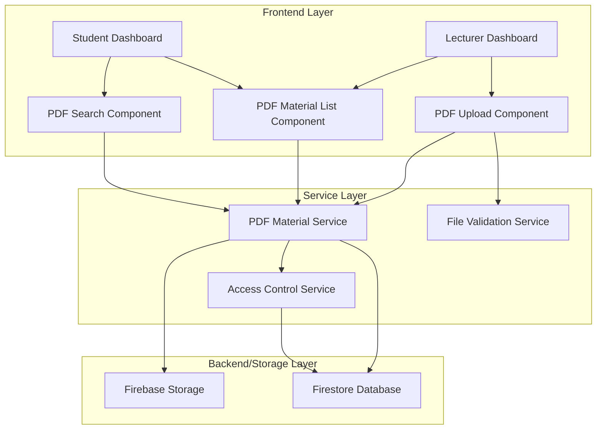

# Design Document: PDF Reading Materials Management

## Overview

This design document specifies the technical architecture for adding PDF reading materials management to the FUTA Campus LearnX Learning Platform. The feature enables lecturers to upload, manage, and organize PDF documents as supplementary course materials, while students can browse, search, and download these resources.

### Key Objectives

1. **Seamless Integration**: Extend the existing video-based learning platform with document management capabilities
2. **Role-Based Access**: Enforce strict access control ensuring lecturers can manage their materials and students can access course-relevant resources
3. **User Experience**: Provide intuitive interfaces for both upload/management (lecturers) and discovery/download (students)
4. **Performance**: Handle PDF files up to 25MB efficiently with progress tracking and error recovery
5. **Scalability**: Design data models and storage architecture to support growing collections of reading materials

### Scope

**In Scope:**
- PDF file upload with validation (format, size limits)
- Metadata management (title, description, course association)
- Material listing, search, and filtering
- Download functionality with tracking
- Access control based on user roles and course enrollment
- Upload progress monitoring and cancellation
- Material analytics for lecturers
- Responsive design for mobile devices

**Out of Scope:**
- In-browser PDF viewing/rendering (files are downloaded, not displayed inline)
- PDF annotation or markup features
- Version control for materials
- Collaborative editing
- Automatic PDF text extraction or indexing
- Integration with external document management systems

## Architecture

### System Components

The PDF reading materials feature integrates into the existing platform architecture with the following components:



### Component Responsibilities

#### Frontend Components

**1. PDF Upload Component (`PDFUploadModal.tsx`)**
- File selection and validation UI
- Upload progress display with percentage, speed, and ETA
- Metadata form (title, description, course selection)
- Upload cancellation
- Error handling and user feedback

**2. PDF Material List Component (`PDFMaterialList.tsx`)**
- Display materials in card/list layout
- Show metadata (title, description, course, date, size, downloads)
- Action buttons (download for students, edit/delete for lecturers)
- Sorting controls
- Responsive grid layout

**3. PDF Search Component (`PDFSearchFilter.tsx`)**
- Search input for title/description filtering
- Course filter dropdown
- Real-time filtering of material list

**4. PDF Analytics Component (`PDFAnalytics.tsx`)**
- Display lecturer statistics (total materials, downloads, top material)
- Download history visualization

#### Service Layer

**1. PDF Material Service (`pdfMaterialService.ts`)**
- CRUD operations for PDF materials
- Upload file to Firebase Storage
- Download file from Firebase Storage
- Query materials by user role and course enrollment
- Track download counts
- Handle upload cancellation

**2. File Validation Service (`fileValidationService.ts`)**
- Validate file type (PDF only)
- Validate file size (max 25MB)
- Generate validation error messages

**3. Access Control Service (extends existing `authService.ts`)**
- Verify user role for operations
- Check lecturer ownership for edit/delete
- Verify student course enrollment for downloads

### Technology Stack

**Frontend:**
- React 18 with TypeScript
- Tailwind CSS for styling
- Existing UI component library (shadcn/ui)
- React hooks for state management

**Backend/Storage:**
- Firebase Storage for PDF file storage
- Firestore for metadata storage
- Firebase Authentication (existing)

**File Handling:**
- Browser File API for file selection
- XMLHttpRequest or Fetch API with progress tracking
- Blob API for download handling

## Components and Interfaces

### Data Models

#### PDFMaterial Interface

```typescript
export interface PDFMaterial {
  id: string;                    // Unique identifier
  title: string;                 // Material title
  description: string;           // Material description
  courseId: string;              // Associated course ID
  courseName: string;            // Associated course name (denormalized)
  lecturerId: string;            // Uploader's user ID
  lecturerName: string;          // Uploader's name (denormalized)
  fileName: string;              // Original file name
  fileSize: number;              // File size in bytes
  fileUrl: string;               // Firebase Storage download URL
  storagePath: string;           // Firebase Storage path
  uploadDate: string;            // ISO 8601 timestamp
  downloadCount: number;         // Number of downloads
  status: 'active' | 'deleted';  // Material status
  createdAt: string;             // ISO 8601 timestamp
  updatedAt: string;             // ISO 8601 timestamp
}
```

#### PDFUploadProgress Interface

```typescript
export interface PDFUploadProgress {
  loaded: number;                // Bytes uploaded
  total: number;                 // Total bytes
  percentage: number;            // Upload percentage (0-100)
  speed: number;                 // Upload speed in bytes/second
  estimatedTimeRemaining: number; // Seconds remaining
}
```

#### PDFMaterialMetadata Interface

```typescript
export interface PDFMaterialMetadata {
  title: string;
  description: string;
  courseId: string;
  courseName: string;
}
```

#### PDFValidationResult Interface

```typescript
export interface PDFValidationResult {
  isValid: boolean;
  error?: string;
}
```

#### PDFAnalytics Interface

```typescript
export interface PDFAnalytics {
  totalMaterials: number;
  totalDownloads: number;
  mostDownloadedMaterial: {
    title: string;
    downloadCount: number;
  } | null;
  mostRecentMaterial: {
    title: string;
    uploadDate: string;
  } | null;
}
```

### Service Interfaces

#### PDFMaterialService

```typescript
class PDFMaterialService {
  /**
   * Upload a PDF file with metadata
   * @param file - PDF file to upload
   * @param metadata - Material metadata
   * @param onProgress - Progress callback
   * @param abortSignal - Abort signal for cancellation
   * @returns Promise resolving to created material
   */
  async uploadMaterial(
    file: File,
    metadata: PDFMaterialMetadata,
    onProgress: (progress: PDFUploadProgress) => void,
    abortSignal?: AbortSignal
  ): Promise<PDFMaterial>;

  /**
   * Get materials for a lecturer
   * @param lecturerId - Lecturer's user ID
   * @returns Promise resolving to array of materials
   */
  async getLecturerMaterials(lecturerId: string): Promise<PDFMaterial[]>;

  /**
   * Get materials available to a student
   * @param studentId - Student's user ID
   * @param enrolledCourseIds - Array of course IDs student is enrolled in
   * @returns Promise resolving to array of materials
   */
  async getStudentMaterials(
    studentId: string,
    enrolledCourseIds: string[]
  ): Promise<PDFMaterial[]>;

  /**
   * Update material metadata
   * @param materialId - Material ID
   * @param metadata - Updated metadata
   * @returns Promise resolving to updated material
   */
  async updateMaterial(
    materialId: string,
    metadata: Partial<PDFMaterialMetadata>
  ): Promise<PDFMaterial>;

  /**
   * Delete a material
   * @param materialId - Material ID
   * @returns Promise resolving when deletion completes
   */
  async deleteMaterial(materialId: string): Promise<void>;

  /**
   * Download a material
   * @param materialId - Material ID
   * @returns Promise resolving to download URL
   */
  async downloadMaterial(materialId: string): Promise<string>;

  /**
   * Increment download count
   * @param materialId - Material ID
   * @returns Promise resolving when count is updated
   */
  async incrementDownloadCount(materialId: string): Promise<void>;

  /**
   * Get analytics for a lecturer
   * @param lecturerId - Lecturer's user ID
   * @returns Promise resolving to analytics data
   */
  async getLecturerAnalytics(lecturerId: string): Promise<PDFAnalytics>;

  /**
   * Search materials by title or description
   * @param materials - Array of materials to search
   * @param searchTerm - Search term
   * @returns Filtered array of materials
   */
  searchMaterials(materials: PDFMaterial[], searchTerm: string): PDFMaterial[];

  /**
   * Filter materials by course
   * @param materials - Array of materials to filter
   * @param courseId - Course ID
   * @returns Filtered array of materials
   */
  filterByCourse(materials: PDFMaterial[], courseId: string): PDFMaterial[];

  /**
   * Sort materials
   * @param materials - Array of materials to sort
   * @param sortBy - Sort criteria
   * @param order - Sort order
   * @returns Sorted array of materials
   */
  sortMaterials(
    materials: PDFMaterial[],
    sortBy: 'uploadDate' | 'title' | 'courseName' | 'downloadCount',
    order: 'asc' | 'desc'
  ): PDFMaterial[];
}
```

#### FileValidationService

```typescript
class FileValidationService {
  /**
   * Validate a PDF file
   * @param file - File to validate
   * @returns Validation result
   */
  validatePDFFile(file: File): PDFValidationResult;

  /**
   * Check if file is PDF format
   * @param file - File to check
   * @returns True if PDF, false otherwise
   */
  isPDFFile(file: File): boolean;

  /**
   * Check if file size is within limit
   * @param file - File to check
   * @param maxSizeMB - Maximum size in megabytes
   * @returns True if within limit, false otherwise
   */
  isWithinSizeLimit(file: File, maxSizeMB: number): boolean;

  /**
   * Format file size for display
   * @param bytes - File size in bytes
   * @returns Formatted string (e.g., "2.5 MB")
   */
  formatFileSize(bytes: number): string;
}
```

### Component Props

#### PDFUploadModal Props

```typescript
interface PDFUploadModalProps {
  isOpen: boolean;
  onClose: () => void;
  onUploadSuccess: (material: PDFMaterial) => void;
  availableCourses: Array<{ id: string; name: string }>;
}
```

#### PDFMaterialList Props

```typescript
interface PDFMaterialListProps {
  materials: PDFMaterial[];
  userRole: 'student' | 'lecturer';
  onDownload: (material: PDFMaterial) => void;
  onEdit?: (material: PDFMaterial) => void;
  onDelete?: (material: PDFMaterial) => void;
  isLoading: boolean;
}
```

#### PDFSearchFilter Props

```typescript
interface PDFSearchFilterProps {
  onSearchChange: (searchTerm: string) => void;
  onCourseFilterChange: (courseId: string | null) => void;
  availableCourses: Array<{ id: string; name: string }>;
  currentSearchTerm: string;
  currentCourseFilter: string | null;
}
```

### Firebase Storage Structure

```
/pdf-materials/
  /{lecturerId}/
    /{materialId}/
      {fileName}.pdf
```

### Firestore Database Structure

**Collection: `pdfMaterials`**

```json
{
  "id": "material-uuid",
  "title": "Introduction to Data Structures",
  "description": "Comprehensive guide covering arrays, linked lists, and trees",
  "courseId": "course-123",
  "courseName": "Computer Science 101",
  "lecturerId": "lecturer-456",
  "lecturerName": "Dr. Johnson",
  "fileName": "data-structures-intro.pdf",
  "fileSize": 2457600,
  "fileUrl": "https://firebasestorage.googleapis.com/...",
  "storagePath": "pdf-materials/lecturer-456/material-uuid/data-structures-intro.pdf",
  "uploadDate": "2024-01-15T10:30:00Z",
  "downloadCount": 42,
  "status": "active",
  "createdAt": "2024-01-15T10:30:00Z",
  "updatedAt": "2024-01-15T10:30:00Z"
}
```

**Indexes:**
- `lecturerId` (for lecturer queries)
- `courseId` (for student queries)
- `status` (for filtering active materials)
- Composite: `courseId + status` (for efficient student queries)
- Composite: `lecturerId + status` (for efficient lecturer queries)

## Data Models

### Extended User Type

The existing `User` interface will be extended to include course enrollment information:

```typescript
export interface User {
  id: string;
  name: string;
  email: string;
  role: 'student' | 'lecturer' | 'admin';
  studentId?: string;
  status: 'active' | 'suspended' | 'pending';
  createdAt: string;
  lastLogin?: string;
  enrolledCourses?: string[];  // NEW: Array of course IDs for students
}
```

### Course Type

A new `Course` interface will be added to support course associations:

```typescript
export interface Course {
  id: string;
  name: string;
  code: string;
  description: string;
  lecturerId: string;
  lecturerName: string;
  enrolledStudents: string[];  // Array of student IDs
  createdAt: string;
  status: 'active' | 'archived';
}
```

### Upload State Management

```typescript
interface UploadState {
  isUploading: boolean;
  progress: PDFUploadProgress | null;
  error: string | null;
  abortController: AbortController | null;
}
```

### Material List State Management

```typescript
interface MaterialListState {
  materials: PDFMaterial[];
  filteredMaterials: PDFMaterial[];
  isLoading: boolean;
  error: string | null;
  searchTerm: string;
  courseFilter: string | null;
  sortBy: 'uploadDate' | 'title' | 'courseName' | 'downloadCount';
  sortOrder: 'asc' | 'desc';
}
```

## Correctness Properties


*A property is a characteristic or behavior that should hold true across all valid executions of a system—essentially, a formal statement about what the system should do. Properties serve as the bridge between human-readable specifications and machine-verifiable correctness guarantees.*

### Property 1: File Validation Completeness

*For any* file selected for upload, the validation system SHALL correctly identify whether the file is a valid PDF (MIME type application/pdf) AND whether the file size is within the 25MB limit, rejecting files that fail either criterion.

**Validates: Requirements 1.1, 1.2**

### Property 2: Required Metadata Validation

*For any* upload submission, the system SHALL reject submissions where title is empty or whitespace-only, OR description is empty or whitespace-only, OR no course is selected.

**Validates: Requirements 1.4, 1.5, 1.6**

### Property 3: Lecturer Material Filtering

*For any* collection of materials and any lecturer ID, querying materials for that lecturer SHALL return only materials where the lecturerId field matches the querying lecturer's ID.

**Validates: Requirements 2.1**

### Property 4: Material Display Completeness

*For any* reading material rendered in either lecturer or student dashboard, the rendered output SHALL contain all required fields: title, description, course name, upload date, file size, and (for lecturer view) download count, and (for student view) lecturer name.

**Validates: Requirements 2.2, 2.3, 2.4, 2.5, 2.6, 2.7, 4.2, 4.3, 4.4, 4.5, 4.6, 4.7**

### Property 5: Student Material Filtering by Enrollment

*For any* collection of materials, any student ID, and any set of enrolled course IDs, querying materials for that student SHALL return only materials where the courseId is in the student's enrolled courses list.

**Validates: Requirements 4.1**

### Property 6: Download Filename Preservation

*For any* material with a given filename, initiating a download SHALL serve the file with the original filename preserved.

**Validates: Requirements 5.2**

### Property 7: Download Count Increment

*For any* material with an initial download count N, successfully completing a download SHALL result in the material's download count becoming N+1.

**Validates: Requirements 5.4**

### Property 8: Role-Based Upload and Delete Access

*For any* user attempting to upload or delete a material, the access control system SHALL permit the operation if and only if the user's role is 'lecturer'.

**Validates: Requirements 6.1, 6.2**

### Property 9: Ownership Verification for Deletion

*For any* lecturer attempting to delete a material, the access control system SHALL permit the deletion if and only if the material's lecturerId matches the requesting lecturer's ID.

**Validates: Requirements 6.3**

### Property 10: Role-Based Download Access

*For any* user attempting to download a material, the access control system SHALL permit the operation if and only if the user's role is 'student' OR 'lecturer'.

**Validates: Requirements 6.4**

### Property 11: Enrollment Verification for Student Downloads

*For any* student attempting to download a material, the access control system SHALL permit the download if and only if the material's courseId is in the student's enrolled courses list.

**Validates: Requirements 6.5**

### Property 12: Authorization Error on Permission Failure

*For any* operation (upload, delete, download) attempted by a user lacking required permissions, the access control system SHALL deny the operation and return an authorization error.

**Validates: Requirements 6.6**

### Property 13: Search Term Matching

*For any* collection of materials and any search term, filtering materials by the search term SHALL return only materials where the title OR description contains the search term (case-insensitive).

**Validates: Requirements 7.2, 7.3**

### Property 14: Course Filter Application

*For any* collection of materials and any course ID, filtering materials by that course SHALL return only materials where the courseId matches the filter value.

**Validates: Requirements 7.5**

### Property 15: Material Sorting Correctness

*For any* collection of materials and any sort criteria (uploadDate, title, courseName, downloadCount) with any order (ascending, descending), sorting the materials SHALL produce a list ordered according to the specified criteria and direction.

**Validates: Requirements 9.2, 9.3, 9.4, 9.5, 9.6, 9.7**

### Property 16: Upload Progress Calculations

*For any* upload progress state with loaded bytes L, total bytes T, and elapsed time E, the calculated percentage SHALL equal (L/T * 100), the speed SHALL equal (L/E), and the estimated time remaining SHALL equal ((T-L)/speed).

**Validates: Requirements 10.2, 10.3**

### Property 17: Analytics Calculations

*For any* collection of materials belonging to a lecturer, the analytics SHALL correctly calculate: total materials count, sum of all download counts, the material with highest download count, and the material with most recent upload date.

**Validates: Requirements 12.1, 12.2, 12.3, 12.4, 12.5**

## Error Handling

### Validation Errors

**File Validation Errors:**
- **Invalid File Type**: "Please select a valid PDF file. Only PDF documents are supported."
- **File Too Large**: "File size exceeds the 25MB limit. Please select a smaller file."
- **File Read Error**: "Unable to read the selected file. Please try again."

**Metadata Validation Errors:**
- **Empty Title**: "Title is required. Please provide a title for the reading material."
- **Empty Description**: "Description is required. Please provide a description for the reading material."
- **No Course Selected**: "Course selection is required. Please select a course for this material."
- **Whitespace-Only Title**: "Title cannot be empty or contain only spaces."
- **Whitespace-Only Description**: "Description cannot be empty or contain only spaces."

### Upload Errors

**Network Errors:**
- **Connection Lost**: "Upload failed due to network error. Please check your connection and try again."
- **Timeout**: "Upload timed out. Please try again with a stable internet connection."
- **Server Error**: "Server error occurred during upload. Please try again later."

**Storage Errors:**
- **Storage Quota Exceeded**: "Storage quota exceeded. Please contact your administrator."
- **Permission Denied**: "You don't have permission to upload files. Please contact your administrator."

### Download Errors

**Access Errors:**
- **Not Enrolled**: "You cannot download this material because you are not enrolled in the associated course."
- **Material Not Found**: "The requested material could not be found. It may have been deleted."
- **Permission Denied**: "You don't have permission to download this material."

**Network Errors:**
- **Download Failed**: "Download failed. Please try again."
- **File Not Available**: "The file is temporarily unavailable. Please try again later."

### Access Control Errors

**Role-Based Errors:**
- **Lecturer Only**: "This action is only available to lecturers."
- **Student/Lecturer Only**: "This action is only available to students and lecturers."
- **Not Owner**: "You can only delete materials you have uploaded."

**Authentication Errors:**
- **Not Authenticated**: "Please log in to access this feature."
- **Session Expired**: "Your session has expired. Please log in again."

### Error Recovery Strategies

**Upload Failures:**
1. Display clear error message indicating the failure reason
2. Preserve form data (metadata) so user doesn't lose their input
3. Provide "Retry Upload" button
4. Log error details for debugging

**Download Failures:**
1. Display error message to user
2. Provide "Retry Download" button
3. Log error for monitoring

**Validation Failures:**
1. Display inline error messages next to relevant form fields
2. Highlight invalid fields with red border
3. Prevent form submission until all validations pass
4. Preserve valid field values

**Network Errors:**
1. Detect network connectivity issues
2. Display user-friendly message
3. Automatically retry with exponential backoff (for background operations)
4. Provide manual retry option

## Testing Strategy

### Overview

The PDF reading materials feature will be tested using a dual approach combining unit tests for specific scenarios and property-based tests for universal properties. This ensures both concrete behavior verification and comprehensive input coverage.

### Property-Based Testing

**Framework:** fast-check (JavaScript/TypeScript property-based testing library)

**Configuration:**
- Minimum 100 iterations per property test
- Each test tagged with feature name and property reference
- Tag format: `Feature: pdf-reading-materials, Property {number}: {property_text}`

**Property Test Implementation:**

Each correctness property defined in this document will be implemented as a property-based test:

1. **Property 1 (File Validation)**: Generate files with various MIME types and sizes, verify validation logic
2. **Property 2 (Metadata Validation)**: Generate form submissions with various metadata combinations, verify rejection of invalid submissions
3. **Property 3 (Lecturer Filtering)**: Generate materials with random lecturer IDs, verify filtering correctness
4. **Property 4 (Display Completeness)**: Generate materials with random data, verify all required fields appear in rendered output
5. **Property 5 (Student Filtering)**: Generate materials and enrollment lists, verify filtering by enrollment
6. **Property 6 (Filename Preservation)**: Generate materials with various filenames, verify download preserves names
7. **Property 7 (Download Count)**: Generate initial counts, perform downloads, verify increment
8. **Property 8 (Role Access)**: Generate users with different roles, verify upload/delete permissions
9. **Property 9 (Ownership)**: Generate materials with different owners, verify deletion permissions
10. **Property 10 (Download Role Access)**: Generate users with different roles, verify download permissions
11. **Property 11 (Enrollment Verification)**: Generate students with different enrollments, verify download permissions
12. **Property 12 (Authorization Errors)**: Generate unauthorized operations, verify all are rejected
13. **Property 13 (Search)**: Generate materials and search terms, verify search results
14. **Property 14 (Course Filter)**: Generate materials with different courses, verify filtering
15. **Property 15 (Sorting)**: Generate materials with random values, verify sorting correctness
16. **Property 16 (Progress Calculations)**: Generate progress states, verify calculation formulas
17. **Property 17 (Analytics)**: Generate material collections, verify analytics calculations

### Unit Testing

**Framework:** Vitest (existing test framework in the project)

**Test Categories:**

**1. Component Tests:**
- PDFUploadModal: Form rendering, validation feedback, upload flow
- PDFMaterialList: Material display, action buttons, empty states
- PDFSearchFilter: Search input, course filter dropdown, filter application
- PDFAnalytics: Statistics display, formatting

**2. Service Tests:**
- PDFMaterialService: CRUD operations, query methods, sorting/filtering
- FileValidationService: File type detection, size checking, error messages
- Access Control: Permission checking, role verification

**3. Integration Tests:**
- Upload flow: File selection → validation → metadata entry → upload → success
- Download flow: Material selection → permission check → download initiation
- Delete flow: Material selection → confirmation → deletion → UI update
- Search flow: Search input → filtering → results display

**4. Error Handling Tests:**
- Network error during upload
- Validation failures
- Permission denied scenarios
- Storage errors

**5. Edge Cases:**
- Empty material lists
- Maximum file size (exactly 25MB)
- Special characters in filenames
- Very long titles/descriptions
- Concurrent uploads

### Mock Strategy

**Firebase Mocks:**
- Mock Firebase Storage for upload/download operations
- Mock Firestore for metadata CRUD operations
- Mock Firebase Authentication for user context

**File Mocks:**
- Create mock File objects with controlled MIME types and sizes
- Use Blob API to simulate file content

**Progress Mocks:**
- Simulate upload progress events with controlled timing
- Test progress calculation with known values

### Test Coverage Goals

- **Line Coverage**: Minimum 80%
- **Branch Coverage**: Minimum 75%
- **Function Coverage**: Minimum 85%
- **Property Test Coverage**: 100% of defined correctness properties

### Testing Workflow

1. **Development**: Write unit tests alongside implementation
2. **Property Tests**: Implement property-based tests after core logic is complete
3. **Integration Tests**: Test complete user flows
4. **Manual Testing**: Test responsive design and user experience
5. **Regression Testing**: Run full test suite before each deployment

### Test Organization

```
src/
  services/
    __tests__/
      pdfMaterialService.test.ts
      pdfMaterialService.properties.test.ts
      fileValidationService.test.ts
      fileValidationService.properties.test.ts
  components/
    __tests__/
      PDFUploadModal.test.tsx
      PDFMaterialList.test.tsx
      PDFSearchFilter.test.tsx
      PDFAnalytics.test.tsx
```

### Continuous Integration

- Run all tests on every pull request
- Block merges if tests fail
- Generate coverage reports
- Track test execution time
- Alert on coverage drops

## Implementation Notes

### Phase 1: Core Infrastructure (Week 1)
- Implement data models and TypeScript interfaces
- Set up Firebase Storage structure
- Create Firestore collection and indexes
- Implement FileValidationService
- Implement basic PDFMaterialService (CRUD operations)

### Phase 2: Upload Functionality (Week 2)
- Implement PDFUploadModal component
- Add upload progress tracking
- Implement upload cancellation
- Add error handling for uploads
- Write unit tests for upload flow

### Phase 3: Display and Management (Week 3)
- Implement PDFMaterialList component
- Add sorting functionality
- Implement edit/delete operations for lecturers
- Add analytics display
- Write unit tests for display components

### Phase 4: Student Features (Week 4)
- Implement student material view
- Add search and filtering
- Implement download functionality
- Add download tracking
- Write unit tests for student features

### Phase 5: Access Control (Week 5)
- Implement role-based access control
- Add ownership verification
- Add enrollment verification
- Write unit tests for access control

### Phase 6: Property-Based Testing (Week 6)
- Set up fast-check framework
- Implement all 17 property-based tests
- Run property tests with 100+ iterations
- Fix any issues discovered by property tests

### Phase 7: Polish and Integration (Week 7)
- Responsive design refinement
- Error message improvements
- Performance optimization
- Integration testing
- User acceptance testing

### Dependencies

**New Dependencies:**
```json
{
  "dependencies": {
    "firebase": "^10.7.0"
  },
  "devDependencies": {
    "fast-check": "^3.15.0",
    "@types/node": "^20.10.0"
  }
}
```

### Performance Considerations

**Upload Optimization:**
- Use chunked uploads for large files
- Implement resumable uploads for reliability
- Show accurate progress with throttled updates (every 100ms)

**Query Optimization:**
- Use Firestore composite indexes for efficient queries
- Implement pagination for large material lists (20 items per page)
- Cache material lists in component state

**Download Optimization:**
- Use Firebase Storage download URLs with expiration
- Implement download retry logic
- Track download progress for large files

### Security Considerations

**File Upload Security:**
- Validate file type on both client and server
- Scan uploaded files for malware (future enhancement)
- Limit upload rate to prevent abuse

**Access Control:**
- Verify permissions on every operation
- Use Firebase Security Rules for server-side enforcement
- Validate user tokens on each request

**Data Privacy:**
- Store only necessary metadata
- Implement audit logging for sensitive operations
- Comply with data retention policies

### Accessibility

**Keyboard Navigation:**
- All interactive elements accessible via keyboard
- Logical tab order
- Visible focus indicators

**Screen Reader Support:**
- Proper ARIA labels for all controls
- Announce upload progress
- Announce error messages

**Visual Design:**
- Minimum 44px touch targets for mobile
- Sufficient color contrast (WCAG AA)
- Clear error messages
- Loading states for all async operations

### Browser Compatibility

**Supported Browsers:**
- Chrome 90+
- Firefox 88+
- Safari 14+
- Edge 90+

**Required APIs:**
- File API
- Fetch API with progress tracking
- Blob API
- LocalStorage

### Future Enhancements

**Phase 2 Features (Future):**
- In-browser PDF preview
- PDF thumbnail generation
- Batch upload
- Material versioning
- Student annotations
- Material sharing between lecturers
- Advanced analytics (view time, completion rate)
- Material recommendations
- Integration with course management system
- Mobile app support
